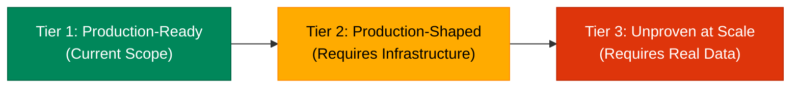

# SentinelDispute — Production Readiness & Architectural Maturity Assessment

> **Engineering Honesty Disclaimer**: This document audits the actual source code of SentinelDispute against enterprise-grade banking and payment gateway production standards. Prototype capabilities are explicitly distinguished from production-ready systems. A passing unit test does not constitute production readiness.

---

## 1. What is Production-Ready vs Production-Shaped?

To ensure technical honesty and credibility under senior engineering review, SentinelDispute delineates its architecture into three distinct operational tiers:



### Tier 1: Production-Ready Within Current Prototype Scope
*Tested, deterministic, and safe to execute within the boundary of this application:*
- **HMAC-SHA256 Ingress Security**: Constant-time signature comparison, timestamp freshness (300s window), event ID replay deduplication, and payload size bounding.
- **Deterministic Evidence Verification**: 100% deterministic, rule-based verification of evidence tokens, delivery dates, and mandatory network criteria without LLM hallucinations.
- **Advisory-Only AI Boundary**: The LLM acts exclusively as an evidence synthesizer and cannot authorize money movement or unilateral representment.
- **Deterministic Safety Gate**: Hard financial gatekeeper that unconditionally routes contradictory, missing, or negative-EV disputes to HITL or Auto-Accept.
- **Tamper-Evident SHA-256 Audit Chain**: Monotonic cryptographic hash chain that detects in-situ mutation, deletion, insertion, or reordering of state transitions.
- **Domain Exception Hierarchy & Failure Provenance**: Structured exceptions capturing component failure provenance and fail-safe circuit breaker routing crashes to HITL.
- **PII Log Redaction**: Automatic regex masking of card PANs, emails, API keys, Bearer tokens, and secrets in structured JSON logs.
- **Fail-Closed Database Guard**: Strict refusal to boot or process disputes using fallback SQLite when `ENVIRONMENT=production`.

### Tier 2: Production-Shaped but Requiring Infrastructure
*Architecturally sound interfaces that require cloud/managed infrastructure to operate at scale:*
- **Asynchronous Queue**: Clean `DisputeProcessingQueue` ABC and Fast-ACK (HTTP 202) API, but the default reference implementation is in-memory and non-durable.
- **Durable Message Broker**: `RedisDisputeQueue` implemented with DLQ and task state hashing, but requires a managed high-availability Redis cluster (ElastiCache / Redis Cloud) and external worker pool orchestrator.
- **Relational Storage**: PostgreSQL connection pooling and schema initialization exist, but lack automated schema migration tooling (Alembic), point-in-time recovery (PITR), and replica routing.
- **Observability & Telemetry**: Structured JSON logging and correlation IDs are implemented, but APM metrics (Prometheus), distributed tracing (OpenTelemetry), and paging (PagerDuty) are not yet integrated.
- **Automated CI/CD**: GitHub Actions workflow verifies unit tests and smoke benchmarks, but blue/green deployment pipelines, canary testing, and staging environments are absent.
- **Perimeter Security**: Application enforces payload limits, but lacks an edge WAF, Layer 7 DDoS mitigation, and dynamic secret rotation.

### Tier 3: Unproven Without Real Production Data
*Hypotheses and algorithms implemented in code that strictly require real-world merchant data to validate:*
- **Win-Probability Calibration**: The default estimator is an expert-curated heuristic baseline. Platt Scaling calibration tooling is mathematically implemented, but cannot be calibrated without historical settled dispute outcomes.
- **Real-World Dispute Recovery Rate**: 100% precision on the synthetic benchmark proves deterministic state machine behavior, but does not predict real-world win rates against live issuing banks.
- **Real-World False Positive Rate (FPR)**: Zero false positives across synthetic adversarial cohorts does not guarantee immunity against novel, unmodeled cardholder fraud tactics.
- **Realized Financial Savings**: Defended GMV reported by benchmarks is a synthetic financial proxy, not realized merchant recovery cash.

---

## 2. Domain-by-Domain Architectural Audit

The following evaluation statuses are applied strictly:
- **✅ Production-ready for current scope**: Implemented, hardened, and defensively sound for the current service boundary.
- **🟡 Prototype / production-shaped**: Correct architectural pattern or abstraction, but uses a simplified or non-distributed implementation.
- **🟠 Requires production infrastructure**: Code is written, but depends on external managed cloud services or infrastructure not configured in this repo.
- **🔴 Not implemented**: Capability is absent and represents future roadmap work.

---

### Domain 1: API Security & Webhook Ingress

| Capability | Current Implementation | Production Status | Actual Gap | Risk | Priority |
| :--- | :--- | :--- | :--- | :--- | :--- |
| **HMAC-SHA256 Verification** | `hmac.compare_digest` with constant-time equality check | ✅ Production-ready for current scope | Operates at application layer; unauthorized requests still reach FastAPI worker | Low | P2 |
| **Timestamp Replay Guard** | Enforces 300s window via `X-Razorpay-Event-Time` | ✅ Production-ready for current scope | Relies on host NTP clock synchronization; no automated NTP skew alerting | Low | P2 |
| **Event Nonce Idempotency** | PostgreSQL unique constraint + status cache lookup | 🟡 Prototype / production-shaped | Single-table lock without distributed Redis `SETNX`; high-concurrency race condition possible across multi-region pods | Medium | P1 |
| **Payload Size Bounding** | 2MB payload ceiling checked before body parsing | ✅ Production-ready for current scope | Evaluated after body buffered into memory; edge reverse-proxy should reject earlier | Low | P2 |
| **Production Enforcement** | Rejects unauthenticated requests when `ENVIRONMENT=production` | ✅ Production-ready for current scope | None within application boundary; requires strict environment variable injection in CD | Low | — |
| **Rate Limiting** | Configuration stub (`RATE_LIMIT_PER_MINUTE=120`) | 🔴 Not implemented | No active token bucket or sliding-window rate limiter per IP or merchant key | High | P1 |
| **WAF / DDoS Mitigation** | None | 🟠 Requires production infrastructure | Susceptible to Layer 7 HTTP flood attacks without Cloudflare or AWS WAF | High | P1 |
| **IP Origin Allowlisting** | Relies entirely on cryptographic HMAC verification | 🟠 Requires production infrastructure | Does not restrict inbound traffic to Razorpay static CIDR blocks at firewall layer | Medium | P2 |
| **Secrets Rotation** | Loaded once from environment variables at startup | 🟠 Requires production infrastructure | No automated 90-day rotation; requires manual pod restarts on secret update | Medium | P2 |

---

### Domain 2: Asynchronous Queue & Concurrency

| Capability | Current Implementation | Production Status | Actual Gap | Risk | Priority |
| :--- | :--- | :--- | :--- | :--- | :--- |
| **Queue Abstraction** | `DisputeProcessingQueue` ABC with lifecycle states | ✅ Production-ready for current scope | Interface is clean; concrete production runtime depends on external broker | Low | — |
| **Fast-ACK Ingress** | HTTP 202 Accepted via `X-Process-Async: true` | ✅ Production-ready for current scope | Returns task ID immediately, but polling is required rather than webhook callbacks | Low | P2 |
| **In-Memory Worker** | `InMemoryBackgroundQueue` via `ThreadPoolExecutor` | 🟡 Prototype / production-shaped | **Non-durable**: queued tasks vanish on process crash, container restart, or serverless cold-start | Critical | P1 |
| **Task State Sharing** | In-memory dictionary protected by threading locks | 🟡 Prototype / production-shaped | State is private to a single process; sibling pods behind a load balancer cannot share task states | High | P1 |
| **Redis Queue Broker** | `RedisDisputeQueue` with JSON task hashing & DLQ | 🟠 Requires production infrastructure | Implemented in code, but requires managed Redis cluster, worker autoscaling, and worker heartbeats | Medium | P1 |
| **Distributed Locking** | Single-node threading locks | 🔴 Not implemented | No Redlock or distributed mutex across multiple competing consumer instances | High | P1 |
| **Dead-Letter Queue (DLQ)** | In-memory and Redis list routing on failure | 🟡 Prototype / production-shaped | Dead-lettered tasks are isolated, but no automated replay tooling or alert webhook exists | Medium | P2 |

> **Critical Honesty Note on Asynchronous Processing**:  
> SentinelDispute provides a **production-shaped asynchronous queue abstraction with an in-memory reference implementation**. It is suitable for local development, automated CI testing, and low-volume serverless demos. It is **NOT** a durable, distributed production queue. For enterprise scale, a managed message broker (Redis Streams, Celery, or AWS SQS) must be provisioned.

---

### Domain 3: Database & Persistence

| Capability | Current Implementation | Production Status | Actual Gap | Risk | Priority |
| :--- | :--- | :--- | :--- | :--- | :--- |
| **PostgreSQL Integration** | `psycopg3` direct pool connection to Supabase | 🟡 Prototype / production-shaped | Basic schema is managed via in-code raw DDL rather than formal migration tools | Medium | P1 |
| **Production Fail-Closed** | Raises `RuntimeError` if PostgreSQL is unavailable | ✅ Production-ready for current scope | Prevents accidental silent fallback to SQLite in production | Low | — |
| **Local Dev Fallback** | SQLite fallback preserved strictly for test/dev | ✅ Production-ready for current scope | Threading timeout set to 15s; acceptable for local single-user execution | Low | — |
| **Schema Migrations** | `CREATE TABLE IF NOT EXISTS` at boot | 🔴 Not implemented | No versioned migration tool (Alembic); cannot rollback or track schema deltas safely | High | P1 |
| **Automated Backups & PITR** | None configured in code | 🟠 Requires production infrastructure | Relies entirely on cloud provider defaults; no automated disaster recovery testing | High | P1 |
| **Read/Write Splitting** | Single connection string for all reads and writes | 🟠 Requires production infrastructure | High-throughput analytics queries could degrade transactional webhook writes | Medium | P2 |
| **Least-Privilege Roles** | Uses primary postgres connection credentials | 🟠 Requires production infrastructure | Application holds DDL rights; production should use a restricted DML-only role | Medium | P2 |

---

### Domain 4: AI Provider & Advisory Boundary

| Capability | Current Implementation | Production Status | Actual Gap | Risk | Priority |
| :--- | :--- | :--- | :--- | :--- | :--- |
| **Structured Output Schema** | Pydantic JSON schema via OpenAI `response_format` | ✅ Production-ready for current scope | Guarantees strict JSON structure, but does not guarantee semantic correctness | Low | — |
| **Advisory-Only Boundary** | AI emits recommendations; zero execution authority | ✅ Production-ready for current scope | Architectural boundary is absolute and strictly enforced by the state machine | Low | — |
| **Provider Redundancy** | Single provider (`OpenAIProvider` with `Mock` fallback) | 🟡 Prototype / production-shaped | No automated failover to alternate LLM providers (Anthropic, Gemini) if OpenAI suffers an outage | Medium | P2 |
| **Circuit Breaker on Failure** | Unhandled provider errors route dispute to HITL | ✅ Production-ready for current scope | Fails safe to human review rather than dropping the dispute or auto-accepting | Low | — |
| **Spend & Token Quotas** | Fixed model selection (`gpt-4o-mini`) | 🟡 Prototype / production-shaped | No hard daily token limits or per-tenant budget alerting configured in code | Medium | P2 |
| **Prompt Drift Monitoring** | Static prompt templates | 🔴 Not implemented | No automated monitoring for semantic drift across OpenAI model snapshot updates | Low | P3 |

---

### Domain 5: Deterministic Evidence Verification & Safety Gate

| Capability | Current Implementation | Production Status | Actual Gap | Risk | Priority |
| :--- | :--- | :--- | :--- | :--- | :--- |
| **Deterministic Verifier** | Pure Python rule engine (`DeterministicEvidenceVerifier`) | ✅ Production-ready for current scope | 100% deterministic code; independent of LLM reasoning | Low | — |
| **Contradiction Detection** | Explicit GPS (>50m), delivery status, and date checks | ✅ Production-ready for current scope | Checks are hardcoded; novel contradictory signals require new rule functions | Low | — |
| **Policy Provenance** | `PolicyExcerpt` with `document_version` & `source_hash` | ✅ Production-ready for current scope | Local curated policy corpus; requires manual updates when card schemes revise rules | Low | — |
| **Deterministic Safety Gate** | Final authority enforcing 4 boolean invariants | ✅ Production-ready for current scope | Overrides AI completely on rule failure, negative EV, or contradiction | Low | — |
| **3DS Liability Shift Gate** | Verified as canonical evidence item `EV-003` | ✅ Production-ready for current scope | Requires authentic gateway 3DS telemetry payload; mocked in local tests | Low | — |

---

### Domain 6: Win Probability & Expected Value

| Capability | Current Implementation | Production Status | Actual Gap | Risk | Priority |
| :--- | :--- | :--- | :--- | :--- | :--- |
| **Estimator Abstraction** | `BaseWinProbabilityEstimator` ABC with explicit flags | ✅ Production-ready for current scope | Clean interface separating heuristic from empirical calibrated models | Low | — |
| **Default Heuristic Estimator** | Piecewise linear model (`is_calibrated=False`) | 🟡 Prototype / production-shaped | **Uncalibrated**: maps evidence scores to estimated win probabilities heuristically | High | P1 |
| **Platt Scaling Engine** | Logistic regression fitting via gradient descent | 🟡 Prototype / production-shaped | Implemented and guarded ($\ge 50$ samples), but uncalibrated in practice without real data | Medium | P1 |
| **Historical Outcome Ingestion** | Batch ingestion API (`POST /disputes/outcomes/batch`) | 🟡 Prototype / production-shaped | Endpoints exist, but no real settled merchant outcomes have been ingested | High | P1 |
| **Calibration Metrics** | Brier Score, ECE, Reliability Curves, Cost-Loss | ✅ Production-ready for current scope | Mathematical evaluation tools are verified and accurate | Low | — |

> **Critical Honesty Note on Probability Calibration**:  
> SentinelDispute does **NOT** currently have an empirically calibrated machine learning model. The default estimator is an **explicitly uncalibrated heuristic baseline**. While the mathematical scaffolding for Platt scaling, Brier score, and Expected Calibration Error (ECE) is implemented, genuine probability calibration strictly requires historical merchant dispute outcomes from real card scheme adjudications.

---

### Domain 7: Audit Chain & Cryptographic Integrity

| Capability | Current Implementation | Production Status | Actual Gap | Risk | Priority |
| :--- | :--- | :--- | :--- | :--- | :--- |
| **Cryptographic Hash Chain** | SHA-256 linking prev_hash, timestamp, actor, payload | ✅ Production-ready for current scope | Append-only in-memory and database persistence with verifiable continuity | Low | — |
| **Tamper-Evidence Testing** | 7 tests covering mutation, deletion, insertion, reorder | ✅ Production-ready for current scope | Validates that any tampering breaks downstream hash verification | Low | — |
| **External WORM Storage** | None (stored in primary PostgreSQL database) | 🟠 Requires production infrastructure | A compromised database admin could recompute the entire hash chain | Medium | P2 |
| **Digital Signatures (PKI)** | SHA-256 hashes without asymmetric private keys | 🟠 Requires production infrastructure | Proves chain continuity, but does not provide individual asymmetric non-repudiation | Medium | P2 |

> **Critical Honesty Note on Audit Chain Terminology**:  
> SentinelDispute implements a **tamper-evident SHA-256 audit chain**, **NOT** an "immutable blockchain" or "legally non-repudiable ledger." It proves whether records have been modified post-creation, but does not prevent an attacker with full database and application control from rewriting history unless mirrored to external Write-Once-Read-Many (WORM) storage.

---

### Domain 8: Observability, Logging & Exception Handling

| Capability | Current Implementation | Production Status | Actual Gap | Risk | Priority |
| :--- | :--- | :--- | :--- | :--- | :--- |
| **Structured JSON Logging** | Standardized JSON output across all modules | ✅ Production-ready for current scope | Easily ingestable by FluentBit / Datadog / CloudWatch | Low | — |
| **PII Redaction** | Regex masking of PANs, emails, API keys, tokens | ✅ Production-ready for current scope | Protects log storage against sensitive customer data leakage | Low | — |
| **Correlation Tracing** | `X-Correlation-Id` UUID propagated through pipeline | ✅ Production-ready for current scope | Tracing across microservice boundaries requires W3C TraceContext headers | Low | P2 |
| **Sanitized Error Responses** | Global exception handler strips internal diagnostics in prod | ✅ Production-ready for current scope | Returns safe messages with correlation IDs; prevents credential leakage | Low | — |
| **Metrics Exporter (Prometheus)** | None | 🔴 Not implemented | No `/metrics` endpoint exposing counter/histogram metrics for throughput/latency | Medium | P1 |
| **Automated Alerting** | None | 🔴 Not implemented | No PagerDuty or Slack webhooks triggered on elevated HITL rates or queue backlog | High | P1 |

---

### Domain 9: Testing, CI/CD & Deployment

| Capability | Current Implementation | Production Status | Actual Gap | Risk | Priority |
| :--- | :--- | :--- | :--- | :--- | :--- |
| **Unit Test Suite** | 125 automated tests covering all components | ✅ Production-ready for current scope | Fast execution (~8s), high branch coverage across safety rules and guards | Low | — |
| **Adversarial Benchmark** | 115-scenario synthetic held-out regression suite | ✅ Production-ready for current scope | Excellent for regression, but synthetic; not real-world merchant performance | Low | — |
| **CI/CD Pipeline** | GitHub Actions on Python 3.11 & 3.12 | ✅ Production-ready for current scope | Validates compilation, tests, audit integrity, and benchmark smoke tests | Low | — |
| **Staging Environment** | Local Docker Compose + Vercel deployment | 🟡 Prototype / production-shaped | Vercel serverless has execution timeouts; lacks dedicated persistent staging cluster | Medium | P2 |
| **Load & Stress Testing** | None | 🔴 Not implemented | No k6 / Locust load testing data establishing maximum requests-per-second (RPS) | Medium | P2 |

---

## 3. Synthetic Benchmark vs Real-World Validation

SentinelDispute enforces a strict separation between test environments:

| Evaluation Tier | Scope | Provider | Grounding Source | What It Validates |
| :--- | :--- | :--- | :--- | :--- |
| **Synthetic Regression Benchmark** | 115 Scenarios across 16 Cohorts | `MockAIProvider` | Parameterized fixture evidence | Deterministic state machine behavior, edge-case coverage, contradiction blocking, zero false positives under controlled conditions. |
| **LLM Reasoning Smoke Test** | 10 Representative Scenarios | `OpenAIProvider` (`gpt-4o-mini`) | Curated prompt context | Pydantic structured output conformance, 2-pass self-challenge reasoning, and graceful fail-to-HITL on simulated API errors. |
| **Real-World Validation** | Live Merchant Disputes | Gateway Webhooks | Real bank evidence & cardholder history | **Not yet available.** Requires historical merchant dispute resolution data across card networks. |

> **Prominent Benchmark Limitation**:  
> Benchmark results demonstrate deterministic pipeline behavior against controlled scenarios and should **NOT** be interpreted as evidence of real-world dispute win rates or actual financial savings.

---

## 4. Target Production Deployment Architecture

The following diagram illustrates the target enterprise deployment topology required to operate SentinelDispute at scale:

```text
               INBOUND DISPUTE WEBHOOK
                         │
                         ▼
        ┌──────────────────────────────────┐
        │ Cloudflare / AWS WAF (Edge)      │  <-- DDoS, TLS Termination, IP Allowlist
        └──────────────────────────────────┘
                         │
                         ▼
        ┌──────────────────────────────────┐
        │ Ingress Gateway (FastAPI Pods)   │  <-- HMAC-SHA256, Timestamp Replay Check,
        └──────────────────────────────────┘      Fast-ACK (HTTP 202 Accepted)
                         │
            ┌────────────┴────────────┐
            ▼                         ▼
   ┌─────────────────┐       ┌─────────────────┐
   │ PostgreSQL      │       │ Managed Redis   │  <-- Distributed Task Queue (Streams)
   │ (Supabase / RDS)│       │ Cluster (AWS)   │      with DLQ & Task Hashing
   └─────────────────┘       └─────────────────┘
                                      │
                         ┌────────────┴────────────┐
                         ▼                         ▼
               ┌───────────────────┐     ┌───────────────────┐
               │ Dispute Worker #1 │     │ Dispute Worker #N │  <-- Autoscaled Kubernetes Fleet
               └───────────────────┘     └───────────────────┘
                         │
                         ▼
        ┌──────────────────────────────────┐
        │ Sentinel Pipeline Pipeline       │
        │ 1. Evidence Extraction & Dedup   │
        │ 2. Advisory AI Reasoning (LLM)   │
        │ 3. Deterministic Evidence Verif. │
        │ 4. Deterministic Safety Gate     │
        └──────────────────────────────────┘
            │               │              │
            ▼               ▼              ▼
     AUTO-REPRESENT      ROUTE HITL   AUTO-ACCEPT
            │               │              │
            └───────────────┼──────────────┘
                            ▼
        ┌──────────────────────────────────┐
        │ Tamper-Evident SHA-256 Ledger    │
        │ + S3 WORM Object Lock (Archive)  │
        └──────────────────────────────────┘
                            │
                            ▼
        ┌──────────────────────────────────┐
        │ OpenTelemetry + Prometheus APM   │
        │ + PagerDuty Alerting Engine      │
        └──────────────────────────────────┘
```

*Note: This represents the target enterprise architecture. The current build implements the application services, in-memory reference queue, Redis queue adapter, and PostgreSQL database layer.*

---

## 5. Production Migration Roadmap

```text
Phase 1: Current Build ──────► Phase 2: Production Pilot ──────► Phase 3: Enterprise Scale
• Deterministic Safety Gate    • Historical Outcome Ingestion   • Multi-Provider AI Failover
• Evidence Verification        • Platt Empirical Calibration    • Distributed Worker Autoscaling
• Webhook HMAC Security        • Managed Redis Cluster Queue    • S3 WORM Compliance Archive
• Tamper-Evident Hash Chain    • Prometheus / APM Metrics       • High-Throughput Load Testing
• In-Memory Reference Queue    • Automated Alerting (PagerDuty) • Dynamic Network Policy Feed
• Synthetic 115-Case Benchmark • Alembic Database Migrations   • Edge WAF & IP Allowlisting
```

### Phase 1 — Current Build (Completed)
- Deterministic 4-layer trust architecture with advisory-only AI.
- Full unit test coverage (125 tests green).
- Cryptographic hash chain with tamper detection.
- Fast-ACK async queue abstraction with in-memory reference worker and Redis queue adapter.
- Fail-closed PostgreSQL persistence and structured failure provenance.

### Phase 2 — Production Pilot (Prerequisites for Limited Merchant Beta)
- Ingest 500+ settled merchant dispute outcomes from Razorpay resolution webhooks.
- Fit and validate the Platt Scaling win-probability estimator against empirical ground truth.
- Deploy persistent Celery/Redis queue workers on managed cloud infrastructure.
- Configure Alembic database migration tracking.
- Set up Prometheus metrics exporter and PagerDuty alert thresholds on HITL rate spikes.

### Phase 3 — Enterprise Scale (High-Volume Autonomous Operation)
- Multi-provider AI orchestration with automatic fallback between OpenAI, Anthropic, and Gemini.
- Deploy worker fleet on autoscaled Kubernetes pods.
- Mirror audit ledger blocks to AWS S3 with Object Lock in Compliance mode for banking compliance.
- Perform continuous load testing establishing 1,000+ disputes/second sustained throughput.
- Establish automated policy sync pipelines for Visa Resolve Online and Mastercom regulatory updates.
